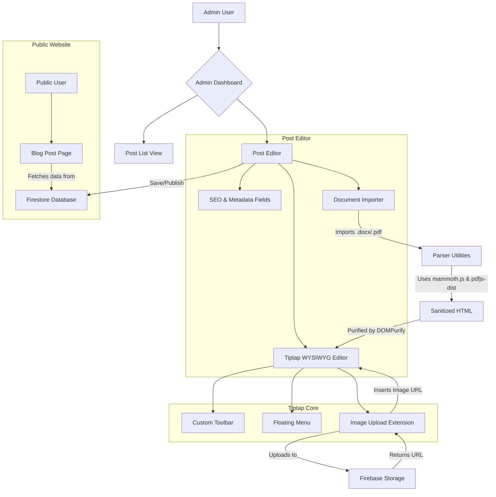

# Project Blueprint: Advanced Blog CMS & Tiptap Editor

## 1. Overview

This document outlines the architecture and implementation plan for building a custom, feature-rich WYSIWYG editor and a fully functional Admin Blog Content Management System (CMS). The primary goal is to provide a seamless and powerful content creation experience with a special focus on accessibility and audience-specific needs for the Chiari Malformation community.

## 2. Core Technologies

- **Frontend:** React (Vite), TypeScript, Tailwind CSS
- **Editor Core:** Tiptap (Headless WYSIWYG)
- **Backend & Storage:** Firebase (Firestore, Firebase Storage)
- **Document Parsing:** `mammoth.js` (.docx), `pdfjs-dist` (PDF)
- **State Management:** Zustand
- **UI & Icons:** `lucide-react`
- **Security:** `dompurify`

## 3. Architecture Diagram

## 4. Implementation Plan

### Phase 1: Setup & Core Editor

- [x] **1. Install Dependencies:**
  - Tiptap: `@tiptap/react @tiptap/starter-kit @tiptap/extension-image @tiptap/extension-link @tiptap/extension-placeholder @tiptap/extension-underline`
  - Parsing: `mammoth pdfjs-dist`
  - Utilities: `lucide-react dompurify reading-time`

- [x] **2. Firebase Setup & Security:**
  - Create `firebase.ts` config file.
  - Implement Firestore security rules to restrict write access to the `posts` collection to admins.

- [x] **3. Basic Editor Component (`/components/editor/TiptapEditor.tsx`):**
  - Initialize Tiptap with `StarterKit`, `Placeholder`, and `Underline` extensions.
  - Create a `Toolbar.tsx` with controls for Bold, Italic, Underline, Strike, Code, Lists, and Headers (H1-H3).
  - Implement a `FloatingMenu.tsx` for quick inline formatting.

### Phase 2: Advanced Editor Features

- [x] **4. Custom Image Handling:**
  - Create a custom Tiptap Image extension.
  - On image drop/paste, upload the file to Firebase Storage.
  - On successful upload, insert the image into the editor with `src` pointing to the Firebase Storage URL.
  - Add UI for alt text and resizing.

- [x] **5. Link Tool:**
  - Enhance the link insertion UI to include a "nofollow" toggle.

- [x] **6. Document Importer (`/components/editor/DocumentImporter.tsx`):**
  - Create the UI for file selection.
  - Implement parser functions in a `lib/parsers.ts` utility file.
    - **Word (.docx):** Use `mammoth.js` to convert to clean HTML.
    - **PDF:** Use `pdfjs-dist` to extract text content.
  - Sanitize all imported HTML with `DOMPurify` before inserting it into the editor.

- [x] **7. Code Block:**
    - Add a `CodeBlockLowlight` extension with language selection and a copy button.

### Phase 3: CMS & Admin Dashboard

- [ ] **8. Update Data Structures (`/types/index.ts`):**
  - Add fields to the `Post` type for SEO metadata (`metaTitle`, `metaDescription`) and reading time.

- [ ] **9. Create New Admin Pages:**
  - `PostManager.tsx`: The main list view for all posts, showing status, and providing Edit/Delete actions.
  - `PostForm.tsx`: The form for creating/editing a post. This will house the `TiptapEditor` and other metadata fields.

- [ ] **10. CMS Workflow & State:**
  - Use a Zustand store (`editorStore.ts`) to manage editor state.
  - **Auto-save:** Implement a `useAutosave` hook that periodically saves the draft to Firestore.
  - **Preview Mode:** Add a toggle to `PostForm.tsx` to render the content in a read-only, styled view.
  - **Publishing:** Add validation to the "Publish" button to ensure required fields are filled.
  - **Reading Time:** Calculate and display reading time using the `reading-time` package.

### Phase 4: Audience-Specific Features & Final Polish

- [ ] **11. Accessibility & UX Enhancements:**
  - **Dark Mode:** Implement a dark mode for the editor UI.
  - **Readability Score:** If feasible, integrate a library to calculate a Flesch-Kincaid score.
  - Ensure all editor controls are keyboard accessible and have proper ARIA labels.

- [ ] **12. Refactor and Integrate:**
  - Replace the old `PostEditor.tsx` with the new `PostForm.tsx` in the admin routes.
  - Ensure the entire workflow from creating a post to viewing it on the public site is seamless.
  - Update `blueprint.md` to reflect completed tasks.

### Phase 5: Editor Showcase

- [x] **13. Create Editor Page (`/pages/EditorPage.tsx`):**
    - Create a new page to display the Tiptap editor.
    - Add a "Save" button to download the content as an HTML file.
- [x] **14. Add Editor Route:**
    - Add a new route in `App.tsx` to render the `EditorPage`.
